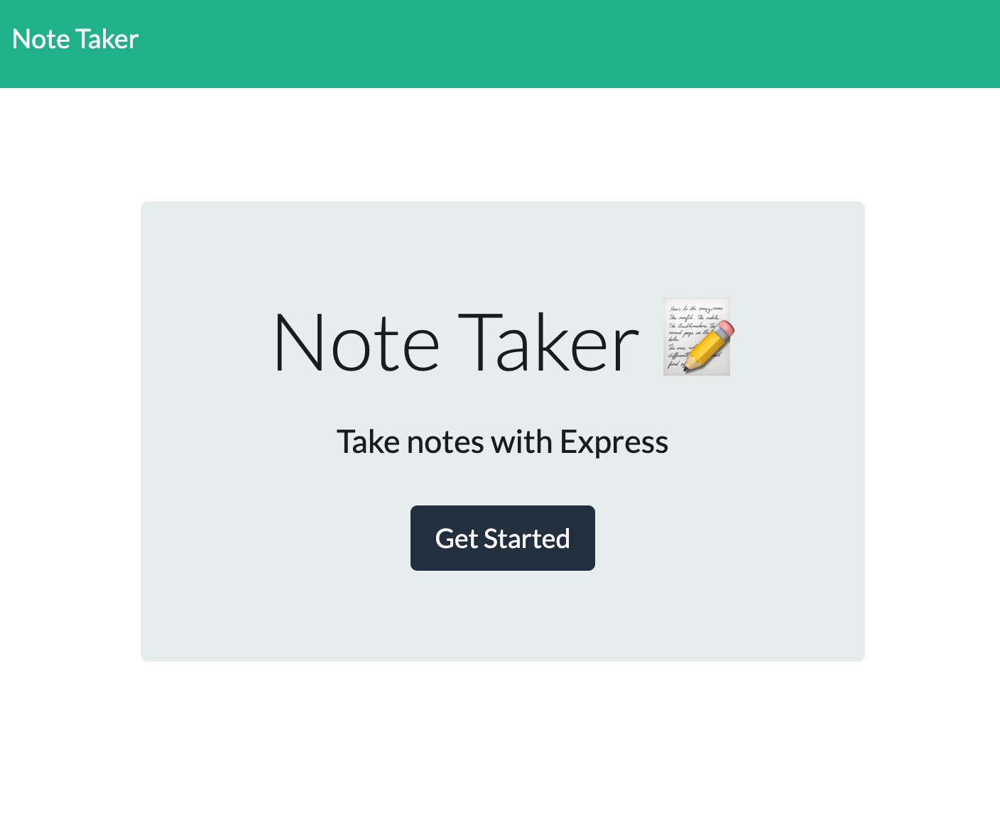

# Note Taker

## Description

An application that can be used to write, save, and delete notes. My first foray into using express and writing back-end code. It will retrieve note data from a JSON file.

* The following HTML routes were created:

  * GET `/notes` - return the `notes.html` file.

  * GET `*` - return the `index.html` file

* The following API routes were be created:

  * GET `/api/notes` - reads the `db.json` file and return all saved notes as JSON.

  * POST `/api/notes` - recieves a new note to save on the request body, add it to the `db.json` file, and then return the new note.

  * DELETE `/api/notes/:id` - recieves a query paramter containing the id of a note to delete. 

## User Story

AS A user, I want to be able to write and save notes

I WANT to be able to delete notes I've written before

SO THAT I can organize my thoughts and keep track of tasks I need to complete

## Business Context

For users that need to keep track of a lot of information, it's easy to forget or be unable to recall something important. Being able to take persistent notes allows users to have written information available when needed.

## How to Use

Let's get started! Click on the Get Started button on the home page to start adding notes. 
When you get to the notes page, on the left, you see saved notes along with a delete icon to trash the note when you're done. 
On the right, you can create a new note with a title and notes within the description. 
On the top right-hand corner, you can click save to automatically save the new note to the list on the left. 

## Credit and Thanks
- Anthony Garza
- Bootcamp TA's

## Check out my work:

* Website: https://note-taker-boom.herokuapp.com/

* GitHub: https://github.com/kimiinglet/note-taker

